# Verwerkingsstroom Afwijsredenen

Dit diagram visualiseert de volledige verwerkingsstroom van afwijsredenen, van gebruikersinteractie tot weergave in de grid.

```mermaid
flowchart TD
    Start([👤 Gebruiker klikt op<br/>Afwijsredenen Tab]) --> CheckTab{Tab al<br/>geïnitialiseerd?}

    CheckTab -->|Nee| CreateTab[📋 Creëer AfwijsredenenSubTab]
    CheckTab -->|Ja| ShowTab[👁️ Toon bestaande tab]

    CreateTab --> CreatePanel[🔧 Creëer NOWAfwijsredenenGridPanel]
    CreatePanel --> CreateGrid[📊 Creëer NOWAfwijsredenenGrid]
    CreateGrid --> ConfigGrid[⚙️ Configureer Grid<br/>- setAllRowsVisible true<br/>- SelectionMode NONE<br/>- Kolom: Omschrijving]
    ConfigGrid --> SetDataProvider[🔌 Setup Data Provider<br/>setItemsPageable]

    ShowTab --> SetDataProvider

    SetDataProvider --> TabVisible[✅ Tab wordt zichtbaar]
    TabVisible --> TriggerFetch[⚡ Vaadin triggert<br/>data fetch]
    TriggerFetch --> FetchData[📞 fetchData wordt aangeroepen]

    FetchData --> GetLHNR{LHNR<br/>beschikbaar?}

    GetLHNR -->|Nee| EmptyList[📭 Return lege lijst]
    EmptyList --> ShowEmpty[💭 Grid toont<br/>Geen gegevens beschikbaar]
    ShowEmpty --> End([🏁 Einde])

    GetLHNR -->|Ja| LogLHNR[📝 Log: Zoek afwijsredenen<br/>voor LHNR]
    LogLHNR --> CallService[🔄 Roep NOWService aan<br/>findAfwijsredenen config lhnr]
    CallService --> ServiceGetDao[🎯 Service haalt<br/>AfwijsredenenDao op]
    ServiceGetDao --> DaoQuery[🗄️ DAO bepaalt query<br/>op basis van regelingId]

    DaoQuery --> CheckRegelingId{RegelingId<br/>== 1?}

    CheckRegelingId -->|Ja| UseNOW1[📄 Gebruik<br/>RAN_NOW1_AFWIJSREDENEN_VW]
    CheckRegelingId -->|Nee| UseNOWX[📄 Gebruik<br/>RAN_NOWX_AFWIJSREDENEN_VW]

    UseNOW1 --> CreateQuery1[🔨 Create Native Query<br/>SELECT ROWNUM as ID, LHNR,<br/>1 AS NOW_REGELING_ID,<br/>OMSCHRIJVING, PRIO<br/>WHERE LHNR = ?]
    UseNOWX --> CreateQueryX[🔨 Create Native Query<br/>SELECT ROWNUM as ID, LHNR,<br/>NOW_REGELING_ID,<br/>OMSCHRIJVING, PRIO<br/>WHERE LHNR = ?<br/>AND NOW_REGELING_ID = ?]

    CreateQuery1 --> BindParams1[🔗 Bind parameter:<br/>LHNR]
    CreateQueryX --> BindParamsX[🔗 Bind parameters:<br/>LHNR, regelingId]

    BindParams1 --> ExecuteSQL
    BindParamsX --> ExecuteSQL[💾 Execute SQL query<br/>naar Oracle Database]

    ExecuteSQL --> GetResults[📊 Database retourneert<br/>resultset]
    GetResults --> StreamEntities[🌊 DAO retourneert<br/>Stream&lt;NOWAfwijsredenEntity&gt;]
    StreamEntities --> MapToBean[🔄 Service mapt<br/>Entity naar Bean<br/>via CopyProperties]
    MapToBean --> CollectList[📦 Collect Stream<br/>naar List&lt;NOWAfwijsredenBean&gt;]
    CollectList --> LogResults[📝 Log: aantal resultaten]
    LogResults --> ReturnToGrid[⬆️ Return lijst naar Grid]
    ReturnToGrid --> GridRender[🎨 Grid rendert data]
    GridRender --> ShowRows[📋 Elke bean wordt<br/>als rij getoond]
    ShowRows --> AdjustHeight[📏 Grid past hoogte aan<br/>aan aantal rijen]
    AdjustHeight --> UserSees[👀 Gebruiker ziet<br/>afwijsredenen in grid]
    UserSees --> End

    style Start fill:#e1f5e1,stroke:#4caf50,color:#000
    style End fill:#ffe1e1,stroke:#f44336,color:#000
    style ShowEmpty fill:#ffe1e1,stroke:#f44336,color:#000
    style CheckTab fill:#fff4e1,stroke:#ff9800,color:#000
    style GetLHNR fill:#fff4e1,stroke:#ff9800,color:#000
    style CheckRegelingId fill:#fff4e1,stroke:#ff9800,color:#000
    style ExecuteSQL fill:#e1e5ff,stroke:#3f51b5,color:#000
    style UseNOW1 fill:#e1e5ff,stroke:#3f51b5,color:#000
    style UseNOWX fill:#e1e5ff,stroke:#3f51b5,color:#000
    style CreateQuery1 fill:#e1e5ff,stroke:#3f51b5,color:#000
    style CreateQueryX fill:#e1e5ff,stroke:#3f51b5,color:#000
    style UserSees fill:#e1f5e1,stroke:#4caf50,color:#000
```

## Legenda

| Kleur | Betekenis |
|-------|-----------|
| 🟢 Groen | Start / Succes |
| 🔴 Rood | Einde / Fout / Lege staat |
| 🟡 Geel | Beslissingspunten |
| 🔵 Blauw | Database-operaties |

## Beschrijving van de fasen

### 1. Gebruikersinteractie
De gebruiker klikt op de **Afwijsredenen Tab**. Indien de tab nog niet geïnitialiseerd is, worden de UI-componenten aangemaakt.

### 2. UI-initialisatie
Er worden drie componenten aangemaakt:
- `AfwijsredenenSubTab` — de tabbladcontainer
- `NOWAfwijsredenenGridPanel` — het paneel rondom de grid
- `NOWAfwijsredenenGrid` — de datagrid met configuratie (`setAllRowsVisible`, `SelectionMode.NONE`, kolom Omschrijving)

### 3. Data Provider Setup
De grid wordt geconfigureerd met een Vaadin data provider via `setItemsPageable`.

### 4. Data Fetch Trigger
Zodra de tab zichtbaar wordt, triggert Vaadin automatisch een data-ophaalactie (`fetchData`).

### 5. Service Logic
`NOWService.findAfwijsredenen(config, lhnr)` wordt aangeroepen. De service haalt de `AfwijsredenenDao` op en delegeert de query.

### 6. Query Bepaling
De DAO bepaalt welke view gebruikt wordt op basis van `regelingId`:
- `regelingId == 1` → `RAN_NOW1_AFWIJSREDENEN_VW`
- anders → `RAN_NOWX_AFWIJSREDENEN_VW`

### 7. Database Query
Een native SQL-query wordt uitgevoerd tegen de Oracle Database.

### 8. Data Mapping
De `Stream<NOWAfwijsredenEntity>` wordt via `CopyProperties` omgezet naar `List<NOWAfwijsredenBean>`.

### 9. Grid Rendering
De lijst wordt teruggegeven aan de grid, die de rijen toont en de hoogte dynamisch aanpast aan het aantal resultaten.
